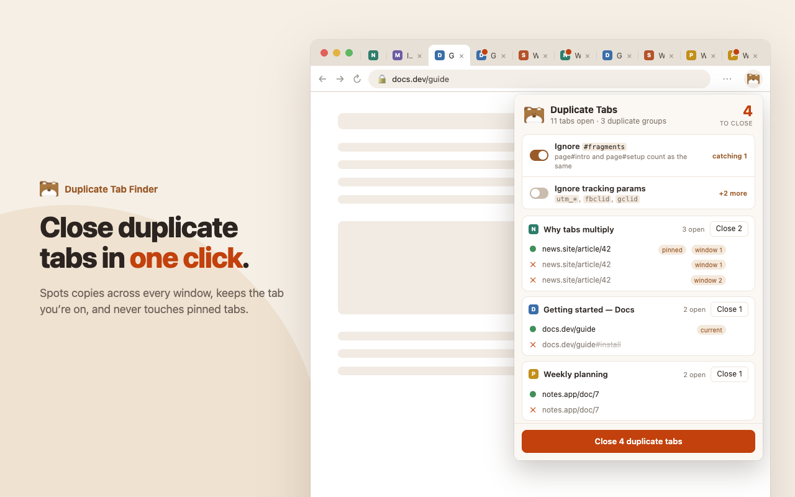

# Duplicate Tab Finder

A Chrome/Firefox extension that finds duplicate tabs and closes them in one click.



- Keeps the active tab (else a pinned one, else the first) and closes the rest. Pinned tabs are never closed.
- Optional: treat URLs as the same when they differ only by `#fragment` or tracking params (`utm_*`, `fbclid`, `gclid`, …).
- Undo restores closed tabs.
- Only needs the `tabs` permission; collects no data.

## Development

Load the folder as an unpacked extension (`chrome://extensions` → Developer mode → Load unpacked).

```sh
node --test test/                          # run tests
cd store-assets && npm i && npm run render # regenerate store screenshots/video
```

## License

[MIT](LICENSE) © Pathanin Lokbow
